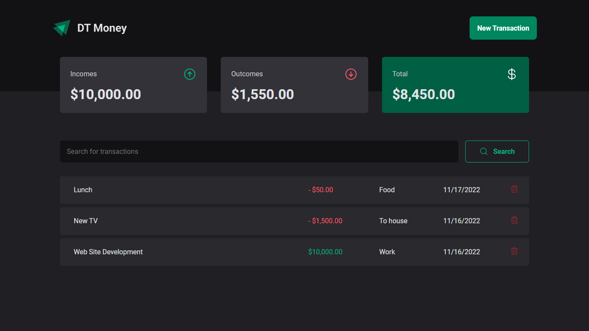
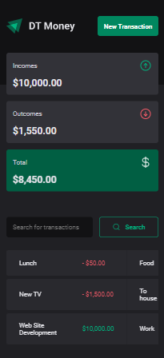

# DT Money - Ignite 2022 - React JS

DT Money is an application to save incomes and outcomes. It sums all of it and show a summary. It has only 1 page.

## Languagues used
* HTML
* CSS (Styled Components)
* javaScript
* TypeScript

## Explanation

The data about transactions is saved in a json file. Json-server library and Axios are used for it, to mimicry a back-end.

The user can:

* **Add a new transacton**: To add, the user has to click on the New Transaction button and fill the form. After it, the data will be saved on file server.json.
* **Delete a transaction**: The transactions saved will be listed in a table below. There is a trash icon that, clicking on it, will delete the transaction.

## Page
### Single page

This application has only 1 page.

## Mobile version

This application has a mobile version. It is 100% responsive.

## How can I use it?

### First
Check if you have the node and npm (comes with node) installed in your machine. To check, you must go to your terminal or command prompt and type:
> node -v
> npm -v

If shows the version, you are good to go. If not, go to https://nodejs.org/en/ and install the LTS version (it will install both node and npm).

### Second

If you don't have an IDE, install one of you preference. In my case, I used Visual Studio Code.

### Third

You clone the project. Use the commande line on your folder:
 > git clone https://github.com/Vinicius-PR/DT-Money.git
 
 ### Forth
 
Open the folder using your IDE. Then, go to the terminal of your IDE and type the following command to install the dependencies: (or can go to the folder application using normal terminal and type the same command)
 > npm install
 
 ### Finally
 
Open two terminals and type the next two commands on each to see the result. One to start the server and other to start the application:
 > npm run dev:server
 > npm run dev